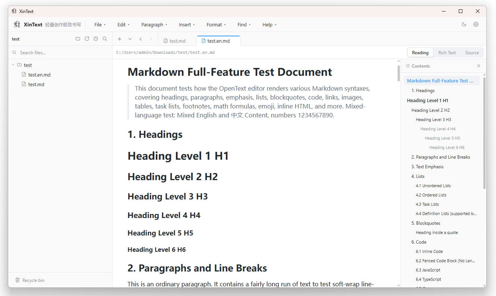

# XinText

English | [简体中文](README.md)

[XinText:](https://gegecoder.github.io/XinText/) Lightweight creation, ultimate writing. 

Author: 心歌 (XinGe) · [Blog https://kevin.blog.csdn.net](https://kevin.blog.csdn.net)

[Download the latest release https://gitcode.com/qq_23994787/XinText/releases](https://gitcode.com/qq_23994787/XinText/releases)

## Features

### Editing & Reading
- **WYSIWYG editing**: edit what you see; pasted images are auto-saved
- **Source-code editing**: split layout with source on the left and live preview on the right; the preview supports one-click copy
- **Reading mode**: statically renders the full document and auto-generates a hierarchical outline (h1–h6) on the right — click to jump, scroll-follow highlighting, collapsible outline; built-in in-page find (Ctrl+F)
- **Fullscreen reading / editing**: immersive fullscreen views, Esc to exit; quick-save supported in fullscreen editing
- **Content zoom**: freely zoom in / out / reset editor and preview content between 100%–200%
- **Find & replace**: `Ctrl+F` find, `Ctrl+H` replace
- **Status hints**: tabs with unsaved changes show a gray dot marker

### File Management
- File tree search with name filtering
- Drag & drop: nodes can be dragged directly to reorder / re-parent
- File tree context menu: new file, new folder, rename, reveal in system file explorer
- **Copy to / Move to**: copy or move files to a chosen directory
- **Recycle bin**: deleted files/folders go to the recycle bin instead of being permanently deleted; supports **restore to a chosen directory**, **delete permanently**, and **empty recycle bin**
- **Recent folders**: quick switching between recent paths, with search filter, single-item removal and clear-all
- Context menu: reveal in File Explorer, view properties
- **File watching**: fsnotify-based recursive watching of the opened directory — external create/modify/delete events auto-refresh the file tree
- **Full-text search**: keyword search across files under the opened directory

### Export
- **Export HTML**: standalone single-file web page
- **Export PDF**: `Ctrl+P` opens the system print dialog directly
- **Export DOCX**: Word document
- **Export TXT**: plain text

### Application Integration
- **System tray**: left-click shows the main window; right-click menu (Show main window / Quit)
- **Close confirmation**: clicking the window X shows a native dialog — Yes minimizes to tray and keeps running, No quits directly, Cancel keeps the window
- **Global shortcuts**: `Ctrl+Alt+N` new / `Ctrl+Alt+O` open / `Ctrl+Alt+S` save (work even when the window is unfocused); in-app `Ctrl+N/O/S/Shift+S`
- **Themes**: light / dark, fully adapted across editor and reading views, applied instantly and persisted
- **Internationalization**: 中文 / English, auto-selected from the system language on first launch, switchable at any time
- **Settings**: a split-pane settings dialog with categories for language, appearance theme, pandoc path, image directory, log directory and recycle-bin location;
- **Image management**: pasted images are centrally stored and deduplicated by content SHA-1;
- **Logging system**: Go logs and frontend console are dual-written (stdout + go.log / frontend.log); the log directory is customizable
- **Global notices**: operation results are surfaced uniformly via lightweight notices

### About & Updates
- **Check for updates**: inline GitCode Releases check on the version row; when a new version is found, a dialog shows release notes with a direct download link

## Tech Stack

| Layer | Technology |
|---|---|
| Desktop framework | [Wails v3](https://v3alpha.wails.io/) v3.0.0-beta.24 (Go bindings + WebView2) |
| Backend | Go 1.25, internal/service layering (file / config / watch / image / export / update / search / log / recycle) |
| Frontend | Vue 3 `<script setup>` + TypeScript + Pinia + Vite |
| Editor | Vditor 4.x (bundled offline, no CDN dependency) |
| UI | Element Plus, SortableJS (file-tree drag), custom frosted-glass dialogs |
| Local storage | SQLite (pure-Go modernc.org/sqlite driver, no CGO), `%AppData%\XinText\system.db`; config/preferences persisted as JSON |
| i18n | dual-language dictionaries on both front and back ends (zh / en), native dialogs translated as well |
| Document conversion | pandoc (HTML / DOCX / TXT); PDF rendered via the system Microsoft Edge headless mode |
| File watching | fsnotify v1.7 (recursive directory watching) |

## License

XinText is open-sourced under the MIT license, for learning and communication purposes only.
See the [LICENSE](LICENSE) file for details.
