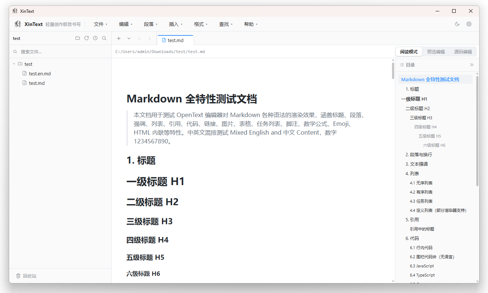

# XinText

[English](README.en.md) | 简体中文

[XinText:](https://gegecoder.github.io/XinText/) 轻量创作极致书写。

作者：心歌 · [博客 https://kevin.blog.csdn.net ](https://kevin.blog.csdn.net) 

[最新版本下载地址 https://gitcode.com/qq_23994787/XinText/releases ](https://gitcode.com/qq_23994787/XinText/releases) 

## 功能特性

### 编辑与阅读
- **预览编辑**：所见即所得编辑，支持图片粘贴自动保存
- **源码编辑**：左侧源码 + 右侧实时预览的分栏布局，预览区支持一键复制
- **阅读模式**：静态渲染全文，右侧自动生成层级目录（h1~h6），点击跳转、滚动跟随高亮、目录可折叠；内置页面内查找（Ctrl+F）
- **全屏阅读 / 全屏编辑**：沉浸式全屏视图，Esc 退出；全屏编辑支持快速保存
- **内容缩放**：编辑器与预览内容自由放大 / 缩小 / 重置 100%-200%
- **查找替换**：`Ctrl+F` 查找、`Ctrl+H` 替换
- **状态提示**：未保存更改的 tab 显示灰色圆点标记

### 文件管理
- 文件树检索，支持名称搜索过滤
- 拖拽移动：节点可直接拖拽调整层级
- 文件树右键菜单，支持新建文件、新建目录、重命名、打开系统资源目录
- **复制到 / 移动到**：支持将文件复制或移动到指定目录
- **回收站**：删除的文件/目录移入回收站而非永久删除；支持**还原到指定目录**、**彻底删除**、**清空回收站**
- **最近文件夹**：历史路径快速切换，支持搜索过滤、单项移除与清空
- 右键菜单：在文件资源管理器中显示、查看属性
- **文件监听**：基于 fsnotify 递归监听已打开目录，外部新增/修改/删除文件时自动刷新文件树
- **全文检索**：在已打开目录下跨文件关键字检索

### 导出
- **导出 HTML**：独立单文件网页
- **导出 PDF**：支持 `Ctrl+P` 直接调起打印
- **导出 DOCX**：Word 文档
- **导出 TXT**：纯文本

### 应用集成
- **系统托盘**：左键显示主窗口，右键菜单（显示主窗口 / 退出）
- **关闭确认**：点窗口 X 弹原生对话框——「是」最小化到托盘后台运行、「否」直接退出、「取消」保持窗口
- **全局快捷键**：`Ctrl+Alt+N` 新建 / `Ctrl+Alt+O` 打开 / `Ctrl+Alt+S` 保存（窗口未聚焦也可用）；应用内 `Ctrl+N/O/S/Shift+S`
- **主题**：亮色 / 暗色，编辑器与阅读视图全量适配，立即生效并持久化
- **国际化**：中文 / English，首次启动按系统语言自动选择，可随时切换
- **设置**：左右分栏设置面板，分类涵盖语言、界面主题、pandoc 路径、图片保存目录、日志目录、回收站位置；
- **图片管理**：粘贴插入图片，按内容 SHA-1 命名集中存储去重；
- **日志系统**：Go 端日志与前端 console 双写（stdout + go.log / frontend.log），日志目录可自定义
- **全局通知**：操作结果统一以轻量 Notice 提示

### 关于与更新
- **检查更新**：版本行内联检测 GitCode Releases，发现新版本弹窗展示更新说明并可直接跳转下载

## 技术栈

| 层 | 技术 |
|---|---|
| 桌面框架 | [Wails v3](https://v3alpha.wails.io/) v3.0.0-beta.24（Go 绑定 + WebView2） |
| 后端 | Go 1.25，internal/service 分层（文件 / 配置 / 监听 / 图片 / 导出 / 更新 / 检索 / 日志 / 回收站） |
| 前端 | Vue 3 `<script setup>` + TypeScript + Pinia + Vite |
| 编辑器 | Vditor 4.x（离线内嵌，无 CDN 依赖） |
| UI 交互 | Element Plus、SortableJS（文件树拖拽）、自研毛玻璃对话框 |
| 本地存储 | SQLite（modernc.org/sqlite 纯 Go 驱动，无 CGO），`%AppData%\XinText\system.db`；配置/偏好 JSON 持久化 |
| 国际化 | 前后端双语字典（zh / en），后端原生对话框同步翻译 |
| 文档转换 | pandoc（HTML / DOCX / TXT）；PDF 由系统 Microsoft Edge 无头模式渲染 |
| 文件监听 | fsnotify v1.7（递归监听目录变化） |

## 许可证
XinText 使用 MIT 协议开源，仅供学习交流使用。
详见 [LICENSE](LICENSE) 文件。